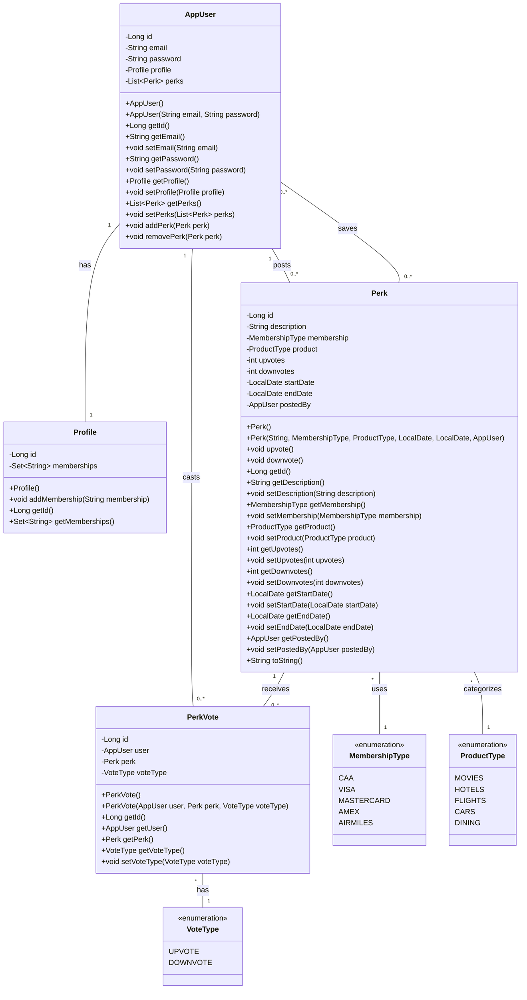
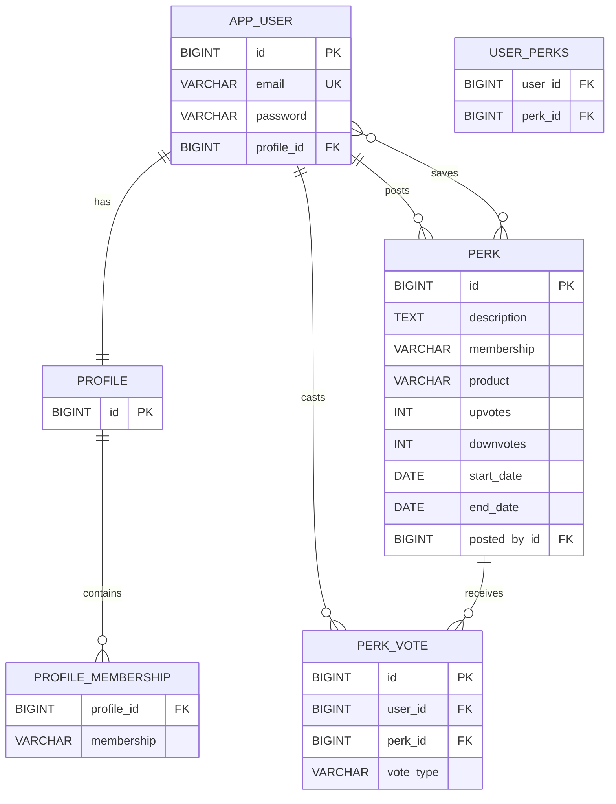

# Perk Manager - Models & Database

## UML Class Diagram

**View diagram:** [uml-class-diagram.mmd](./uml-class-diagram.mmd)



## Entity Relationship Diagram

**View diagram:** [er-diagram.mmd](./er-diagram.mmd)



## SQL Schema

```sql
-- TABLE: profile
CREATE TABLE profile (
  id BIGSERIAL PRIMARY KEY
);

-- TABLE: app_user
CREATE TABLE app_user (
  id BIGSERIAL PRIMARY KEY,
  email VARCHAR(320) NOT NULL UNIQUE,
  password VARCHAR(255) NOT NULL,
  profile_id BIGINT UNIQUE,
  CONSTRAINT fk_app_user_profile
    FOREIGN KEY (profile_id) REFERENCES profile(id)
      ON UPDATE CASCADE ON DELETE SET NULL
);

-- TABLE: profile_membership (ElementCollection for Profile.memberships)
CREATE TABLE profile_membership (
  profile_id BIGINT NOT NULL,
  membership VARCHAR(64) NOT NULL,
  PRIMARY KEY (profile_id, membership),
  CONSTRAINT fk_profile_membership_profile
    FOREIGN KEY (profile_id) REFERENCES profile(id)
      ON UPDATE CASCADE ON DELETE CASCADE
);

-- TABLE: perk
CREATE TABLE perk (
  id BIGSERIAL PRIMARY KEY,
  description TEXT NOT NULL,
  membership VARCHAR(32),  -- MembershipType enum as string
  product    VARCHAR(32),  -- ProductType enum as string
  upvotes    INT NOT NULL DEFAULT 0,
  downvotes  INT NOT NULL DEFAULT 0,
  start_date DATE,
  end_date   DATE,
  posted_by_id BIGINT,
  CONSTRAINT fk_perk_user
    FOREIGN KEY (posted_by_id) REFERENCES app_user(id)
      ON UPDATE CASCADE ON DELETE SET NULL
);

-- TABLE: user_perks (Join table for AppUser.perks many-to-many relationship)
CREATE TABLE user_perks (
  user_id BIGINT NOT NULL,
  perk_id BIGINT NOT NULL,
  PRIMARY KEY (user_id, perk_id),
  CONSTRAINT fk_user_perks_user
    FOREIGN KEY (user_id) REFERENCES app_user(id)
      ON UPDATE CASCADE ON DELETE CASCADE,
  CONSTRAINT fk_user_perks_perk
    FOREIGN KEY (perk_id) REFERENCES perk(id)
      ON UPDATE CASCADE ON DELETE CASCADE
);

-- TABLE: perk_vote (Tracks individual user votes on perks)
CREATE TABLE perk_vote (
  id BIGSERIAL PRIMARY KEY,
  user_id BIGINT NOT NULL,
  perk_id BIGINT NOT NULL,
  vote_type VARCHAR(16) NOT NULL,  -- VoteType enum as string (UPVOTE, DOWNVOTE)
  CONSTRAINT fk_perk_vote_user
    FOREIGN KEY (user_id) REFERENCES app_user(id)
      ON UPDATE CASCADE ON DELETE CASCADE,
  CONSTRAINT fk_perk_vote_perk
    FOREIGN KEY (perk_id) REFERENCES perk(id)
      ON UPDATE CASCADE ON DELETE CASCADE,
  CONSTRAINT uk_perk_vote_user_perk
    UNIQUE (user_id, perk_id)  -- One vote per user per perk
);

-- Helpful indexes
CREATE INDEX idx_perk_membership    ON perk (membership);
CREATE INDEX idx_perk_product       ON perk (product);
CREATE INDEX idx_perk_posted_by     ON perk (posted_by_id);
CREATE INDEX idx_perk_upvotes_desc  ON perk (upvotes DESC);
CREATE INDEX idx_perk_vote_user     ON perk_vote (user_id);
CREATE INDEX idx_perk_vote_perk     ON perk_vote (perk_id);
```
